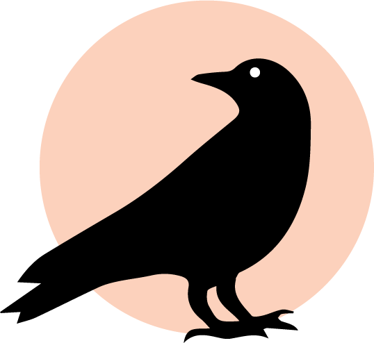

Jackdaw is a Clojure library for the Apache Kafka distributed streaming platform. With Jackdaw, you can create and list topics using the AdminClient API, produce and consume records using the Producer and Consumer APIs, and create stream processing applications using the Streams API. Jackdaw also contains functions to serialize and deserialize records as JSON, EDN, and Avro, as well as functions for writing unit and integration tests.


## Installation

To use the latest release, add the following to your project:

[](https://clojars.org/fundingcircle/jackdaw)

## Documentation

- [API docs](https://fundingcircle.github.io/jackdaw/codox/index.html)


## Examples

- [Pipe](https://github.com/FundingCircle/jackdaw/tree/master/examples/pipe)
- [Word Count](https://github.com/FundingCircle/jackdaw/tree/master/examples/word-count)
- [Simple Ledger](https://github.com/FundingCircle/jackdaw/tree/master/examples/simple-ledger)

## Testing

### TLDR;

```
docker-compose up -d
lein test
```

### A bit more detail

The project includes a docker-compose configuration for running the tests. The
[primary compose file](docker-compose.yml) includes the required services
and exposes their ports without binding them on the host.

The [override compose file](docker-compose.override.yml) binds the services
to their corresponding ports on the host. The override file is loaded by
default so if you simply run `docker-compose up -d` it will seem as if the
services are all running locally and you can connect to them from a REPL
running on your host.

If you wish to avoid this behavior (e.g. you already have your own locally
configured confluent stack), you can use `docker-compose up -d -f docker-compose.yml`
so that the override is ignored.

## Contributing

We welcome any thoughts or patches. You can reach us in [`#jackdaw`](https://clojurians.slack.com/messages/CEA3C7UG0/) (or [open an issue](https://github.com/fundingcircle/jackdaw/issues)).


## License

Copyright © 2017 Funding Circle

Distributed under the BSD 3-Clause License.
